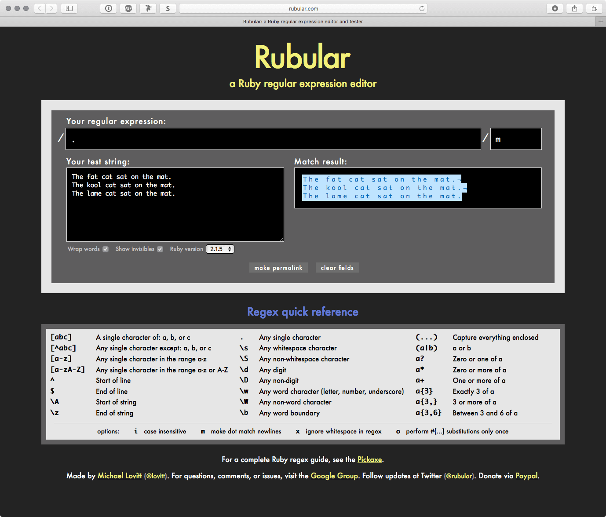
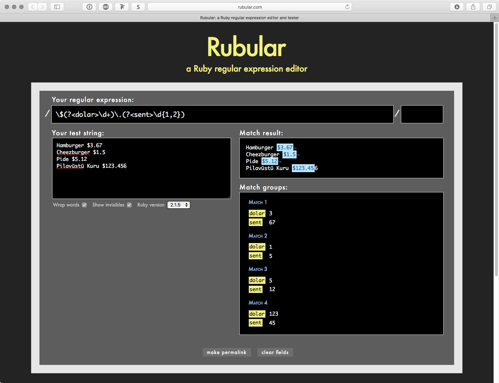

# Ruby Geliştiricileri için Regex 101

Örnekleri web üzerinde denemek için [Rubular][1]’ı kullanabilirsiniz. Tüm
örnekler Ruby için olmasına rağmen neredeyse tüm dillerde de çalışır.

Tüm ifadeleri `/İFADE/SEÇENEKLER` şeklinde yazıyoruz. Seçenekler zorunlu değil.

[1]: http://rubular.com "a Ruby regular expression editor"

## Temel Eşleştirici

    /garaja/

Araba 21 numaralı **==garaja==** park etti ve Vigo kebap yemek için LYK2017 Rails
öğrencileri ile ET Evi'ne gitti.

---

    /Vigo/

Araba 21 numaralı garaja park etti ve **==Vigo==** kebap yemek için LYK2017 Rails
öğrencileri ile ET Evi'ne gitti.

---

## Meta Karakterler

Karakter    | Açıklama
:-----------|:---------
 `.`        | `\n` dışındaki her karakteri yakalar.
 `[ ]`      | Köşeli parantezler içinde geçen tüm karakterler.
 `[^ ]`     | Köşeli parantezler içinde **geçmeyen** tüm karakterler.
 `[a-z]`    | Küçük a’dan küçük z’ye kadar olan tüm karakterler (*a,b,c,d,e,f,g,h,i,j,k....,z*)
 `[a-zA-Z]` | Küçük a’dan küçük z’ye ve büyük A’dan büyük Z’ye kadar olan tüm karakterler (*a,b,c,d,e,f,g,h,i,j,k....,z,A,B,C,D,....,Z*)
 `*`        | En az 0 kez ya da daha çok tekrar eden
 `+`        | En az 1 kez ya da daha çok tekrar eden
 `?`        | Öncesindekiler opsiyonel (*olabilir / olmayadabilir*)
 `{n,m}`    | En az **n** tane ama **m** taneden az tekrar
 `(xyz)`    | Sıralı karakter grubu. Sadece tekrar eden **xyz**’leri yakalar.
 `|`        | Veya işlemi. Öncesindeki ya da sonrasındaki karakterleri yakalar.
 `\`        | Sonraki karakteri **ESCAPE** et. Özellikle rezerve olan `[ ] ( ) { } . * + ? ^ $ \ |` karakterleri için.
 `^`        | Satırın başından itibaren.
 `$`        | Satırın sonuna kadar.
 `\A`       | Metnin başından itibaren.
 `\z`       | Metnin sonuna kadar.
 `\w`       | Her kelime-karakter yani; harf (a-z,A-Z), sayı (0-9) ve alt çizgi `_` (*word character*)
 `\W`       | Her kelime-karakter olmayan yani; harf (a-z,A-Z) olmayan, sayı (0-9) olmayan ve `_` olmayan  (*non-word character*)
 `\d`       | Her sayı olan (*digit*)
 `\D`       | Her sayı **olmayan!** (*non-digit*)
 `\s`       | Görünmeyen her karakter (*whitespace*)
 `\S`       | Görünmeyen olmayan her karakter (*non-whitespace*)
 `\b`       | Kelime sınırı (*word boundary*)
 `( )`      | Parantez içindekileri yakala
 `(a|b)`    | `a` ya da `b`’yi yakala.
 `a{3}`     | `a`’dan 3 tane tekrar
 `a{3,}`    | `a`’dan 3 tane tekrar ya da fazlası (*4,5,6 ne olursa...*)
 `a{3,6}`   | `a`’dan en az 3 tane tekrar, en fazla 6 tane tekrar...

### Nokta: `.`

    /.ar/

Araba 21 nu**==mar==**alı **==gar==**aja **==par==**k etti ve Vigo kebap yemek
için LYK2017 Rails öğrencileri ile ET Evi'ne gitti.

### Karakterler Seti: `[ ]`

    /[Aa]ra/

**==Ara==**ba 21 num**==ara==**lı g**==ara==**ja park etti ve Vigo kebap yemek için LYK2017 Rails
öğrencileri ile ET Evi'ne gitti.

    /ti[.]/

Araba 21 numaralı garaja park etti ve Vigo kebap yemek için LYK2017 Rails
öğrencileri ile ET Evi'ne git**==ti.==**

### Olumsuzlanan/İstenmeyen Karakterler Seti: `[^ ]`

    /[^A]ra/

Araba 21 num**==ara==**lı g**==ara==**ja park etti ve Vigo kebap yemek için LYK2017 Rails
öğrencileri ile ET Evi'ne gitti.

### Tekrarlamalar: `*`

    /[A-Z][A-Z]*/

**==A==**raba 21 numaralı garaja park etti ve **==V==**igo kebap yemek için
**==LYK==**2017 **==R==**ails öğrencileri ile **==ET==** **==E==**vi'ne gitti.

### Tekrarlamalar: `+`

    /[A-Z][A-Z]+/

Araba 21 numaralı garaja park etti ve Vigo kebap yemek için **==LYK==**2017 Rails
öğrencileri ile **==ET==** Evi'ne gitti.

### Opsiyonel: `?`

    /21?/

Araba **==21==** numaralı garaja park etti ve Vigo kebap yemek için
LYK**==2==**017 Rails öğrencileri ile ET Evi'ne gitti.

    /\w+?\d+/

Araba **==21==** numaralı garaja park etti ve Vigo kebap yemek için
**==LYK2017==** Rails öğrencileri ile ET Evi'ne gitti.

### Köşeli Parantez

    /[0-9]/

Araba **==21==** numaralı garaja park etti ve Vigo kebap yemek için
LYK**==2017==** Rails öğrencileri ile ET Evi'ne gitti.

    2 1
    2 0 1 7

Sadece 2 tane tekrar:

    /[0-9]{2}/

Araba **21** numaralı garaja park etti ve Vigo kebap yemek için LYK**2017** Rails
öğrencileri ile ET Evi'ne gitti.

    21
    20
    17

2 tekrar ve üstü:

    /[0-9]{2,}/

Araba **==21==** numaralı garaja park etti ve Vigo kebap yemek için
LYK**==2017==** Rails öğrencileri ile ET Evi'ne gitti.

    21
    2017

En az 2, en çok 3 tekrar:

    /[0-9]{2,3}/

Araba **==21==** numaralı garaja park etti ve Vigo kebap yemek için LYK**==201==**7 Rails
öğrencileri ile ET Evi'ne gitti.

    21
    201

### Parantez

    /(A|a)ra/

**==Ara==**ba 21 num**==ara==**lı g**==ara==**ja park etti ve Vigo kebap yemek
için LYK2017 Rails öğrencileri ile ET Evi'ne gitti.

    1. A
    2. a
    3. a

Grupla;

    /((A|a)ra)/
    
    1. Ara
    2. A
    
    1. ara
    2. a
    
    1. ara
    1. a

Eşleştir ama yakalama!

    /((?:A|a)ra)/
    
    1. Ara
    
    1. ara
    
    1. ara

Alternatifli;

    /(A|a)ra|21/

**==Ara==**ba **==21==** num**==ara==**lı g**==ara==**ja park etti ve Vigo
kebap yemek için LYK2017 Rails öğrencileri ile ET Evi'ne gitti.

Yakalananlar;

    1. A (A-raba)
    
    1. BOŞ (21’i sadece eşleştirdik...)
    
    1. a (num-a-ralı)
    
    1. a (g-a-raja)

### Özel Karakterler: Escape

    /\'|\./

Araba 21 numaralı garaja park etti ve Vigo kebap yemek için LYK2017 Rails
öğrencileri ile ET Evi**=='==**ne gitti**==.==**

`'` ve `.` harflerini yakaladık!

### Özel Karakterler: `^` ve `$`

    /^Araba/

**==Araba==** 21 numaralı garaja park etti ve Vigo kebap yemek için LYK2017 Rails
öğrencileri ile ET Evi'ne gitti. Araba deyip geçmeyin, çok ama çok çok çok
faydalı bir cihazdır. Siz de alın bir Araba

    /Araba$/

Araba 21 numaralı garaja park etti ve Vigo kebap yemek için LYK2017 Rails
öğrencileri ile ET Evi'ne gitti. Araba deyip geçmeyin, çok ama çok çok çok
faydalı bir cihazdır. Siz de alın bir **==Araba==**

---

## Etrafa Bakmak

İlerisinde ve gerisinde bulunan/tekrar eden karakter kontrolü içindir. Parantez
içinde yazılmasına rağmen eşleşmeye etki etmez.

Sembol | Açıklama
:------|:--------------------------------
 `?=`  | İlerisinde varsa
 `?!`  | İlerisinde yoksa
 `?<=` | Gerisinde varsa
 `?<!` | Gerisinde yoksa

### İlerisinde varsa: `?=`

    /(\w+)\d{4}(?=\sRails)/

Araba 21 numaralı garaja park etti ve Vigo kebap yemek için LYK2017 Rails
öğrencileri ile ET Evi'ne gitti. Araba deyip geçmeyin, çok ama çok çok çok
faydalı bir cihazdır. Siz de alın bir Araba. **==LYK==2017** demişken, çok harika
geçti! Umarım LYK2018 de iyi geçer!

    LYK

Eğer yukarıdaki örnekte, `FOO2017 Rails` olsaydı bunu da eşleyecek ve `FOO`
yakalanacaktı.

### İlerisinde yoksa: `?!`

    /(\w+)\d{4}(?!\sRails)/

Araba 21 numaralı garaja park etti ve Vigo kebap yemek için LYK2017 Rails
öğrencileri ile ET Evi'ne gitti. Araba deyip geçmeyin, çok ama çok çok çok
faydalı bir cihazdır. Siz de alın bir Araba. **==LYK==2017** demişken, çok
harika geçti! Umarım **==LYK==2018** de iyi geçer!

    1. LYK
    
    2. LYK

### Gerisinde varsa: `?<=`

    /(?<=LYK)(\d{4})/

Araba 21 numaralı garaja park etti ve Vigo kebap yemek için **LYK==2017==** Rails
öğrencileri ile ET Evi'ne gitti. Araba deyip geçmeyin, çok ama çok çok çok
faydalı bir cihazdır. Siz de alın bir Araba. **LYK==2017==** demişken, çok harika
geçti! Umarım **LYK==2018==** de iyi geçer! Keza bu FOO2017 Rails da örnektir.

    1. 2017
    
    1. 2017
    
    1. 2018

### Gerisinde yoksa: `?<!`

    /(?<!LYK)(\d{4})/

Araba 21 numaralı garaja park etti ve Vigo kebap yemek için LYK2017 Rails
öğrencileri ile ET Evi'ne gitti. Araba deyip geçmeyin, çok ama çok çok çok
faydalı bir cihazdır. Siz de alın bir Araba. LYK2017 demişken, çok harika
geçti! Umarım LYK2018 de iyi geçer! Keza bu **FOO==2017==** Rails da örnektir.

    1. 2017

---

## Seçenekler

Aşağıdaki seçenekler sadece Ruby için geçerlidir. Diğer Regex’lerdeki `g` yani
Global seçeneği Ruby’de yoktur.

Seçenek | Açıklaması
:-------|:------------------------------------------------------------
 `i`    | Küçük-Büyük harfine duyarsız (*Case insensitive*)
 `m`    | `.` meta karakteri ile yeni satır karakterini (`\n`) yakala (*Multiline*).
 `x`    | Bu **free-spacing** modu yani boşluk karakterleri, yorum satırları görmezden gelinir.

### Seçenek: `i`

    /pazar/i

Bugün günlerden **PAZAR**. **Pazar** gününü çok seviyorum.

### Seçenek: `m`

    /./m

    The fat cat sat on the mat.
    The kool cat sat on the mat.
    The lame cat sat on the mat.

Satırların sonunda yeni satır (*new-line*) `\n` karakteri örneği.

---

## Yakalama ve Değişkene Atama: Named Capture

    \$(?<dolar>\d+)\.(?<sent>\d{1,2})

`dolar` değişkenine `$` işaretinden sonra gelen **N TANE** sayı ve bunu takip
eden bir **.** işareti. `sent` ise, en az **1** en faza **2** dijit olacak.

    Hamburger $3.67
    Cheezburger $1.5
    Pide $5.12
    Pilavüstü Kuru $123.456

---

## Kaynaklar

- https://ruby-doc.org/core-2.4.1/Regexp.html
- https://www.tutorialspoint.com/ruby/ruby_regular_expressions.htm
- https://github.com/zeeshanu/learn-regex